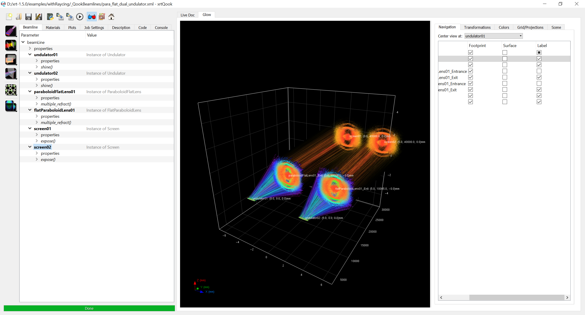

This example is based on xrt 1.5.0, here I show 
1) How to add custom OE class (here we add FlatParaboloidLens based on ParaboloidFlatLens)
2) How to make it avaiable in xrtQook - see the top of oes.py
3) How to add multiple sources / multiple beam paths in xrtQook

